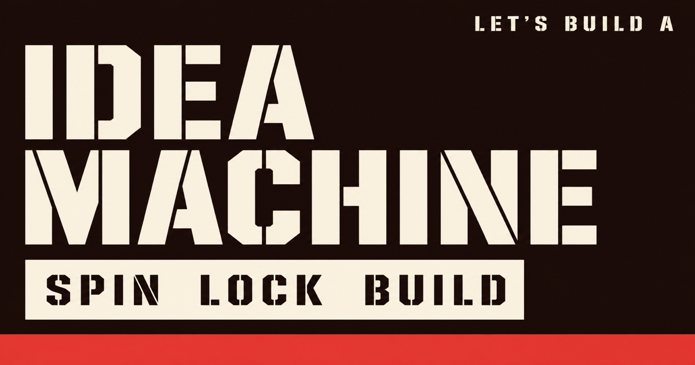

# Idea Machine

[](https://github.com/manavkhadka0/idea-machine/actions/workflows/ci.yml)
[](LICENSE)

Spin a **platform**, a **product**, and a **niche**. Lock the combo. Share it. Build it.

The machine is one page. The community owns the word banks.



## Contribute a word

This is the main way to help.

Edit [`src/components/idea-spinner/word-banks.ts`](src/components/idea-spinner/word-banks.ts).

The combo count on the machine is derived:

```ts
PLATFORMS.length * APP_TYPES.length * NICHES.length
```

Add a label, the number goes up. Do not hardcode it.

Rules, in short:

- 18 characters or fewer (stencil type)
- Unique in that bank, case-insensitive
- No brands, slurs, living people
- Sit next to related words — do not alphabetize the file

Full steps: [CONTRIBUTING.md](CONTRIBUTING.md)

Not sure? Open a [word suggestion](https://github.com/manavkhadka0/idea-machine/issues/new?template=word.yml).

## Run it

```bash
pnpm install
pnpm dev
```

Open the URL Vite prints (port `3000`, or the next free port).

```bash
pnpm validate:banks
pnpm check
pnpm lint
pnpm build
```

## How a combo is shared

Lock writes the address bar:

```
/?p=web&t=warehouse&n=logistics
```

Unknown params are ignored and the machine spins as usual. Locked ideas also stay in **your browser** (last 12). There is no account and no public gallery.

## Stack

TanStack Start, Vite, React, Framer Motion. Styling is Hallmark Brutal tokens in `tokens.css` — please do not drive-by restyle it.

## License

[MIT](LICENSE)
